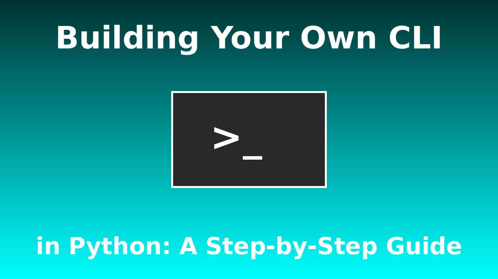

🚀 Building Your Own CLI in Python: A Step-by-Step Guide!

I’ve created a tutorial series on how to build your own Command Line Interface (CLI) in Python! Whether you're a beginner or an advanced developer, this guide will help you master CLI development step by step.

⚡ What You'll Learn:

✅ Using argparse for argument handling

✅ sys module for command-line input

✅ Click for building user-friendly CLIs

✅ Typer for modern and intuitive CLI apps

📌 Stay tuned for more episodes!
🔗 GitHub: https://github.com/LegendCoder505/terminal-in-python

🎮 Discord Server (Still in Progress): https://discord.gg/rDv3WQaAg9